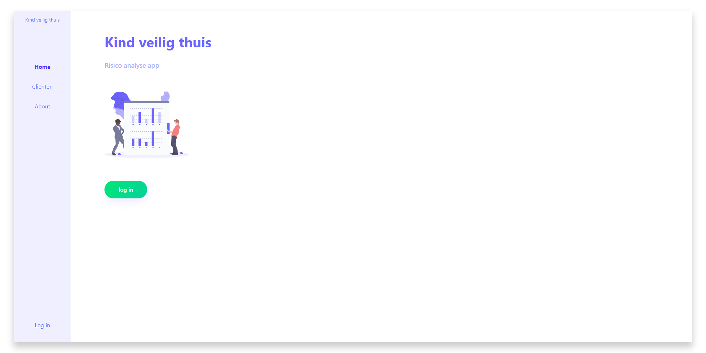
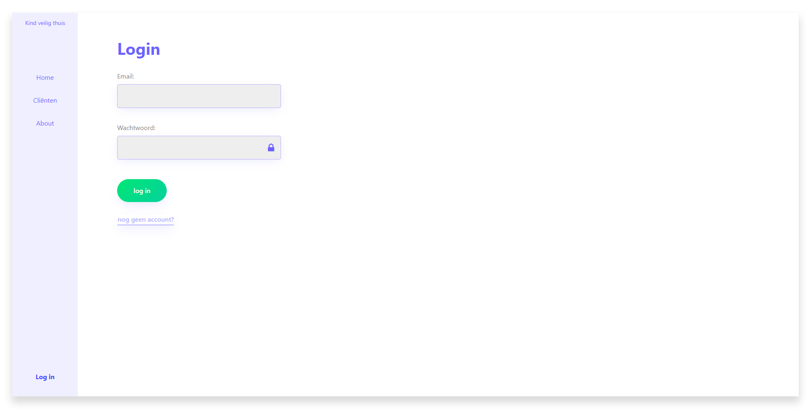
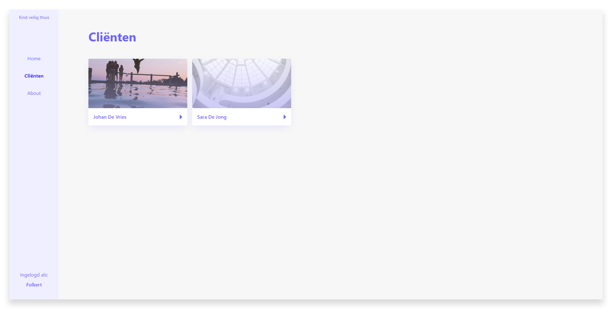
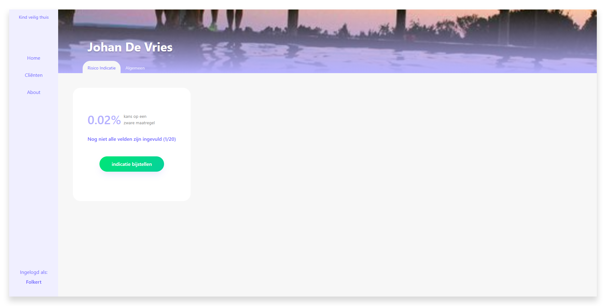
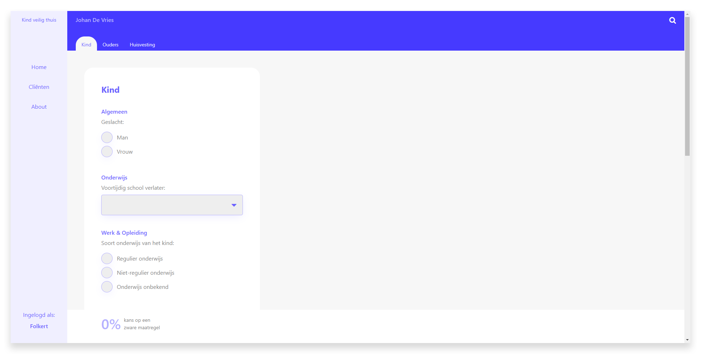
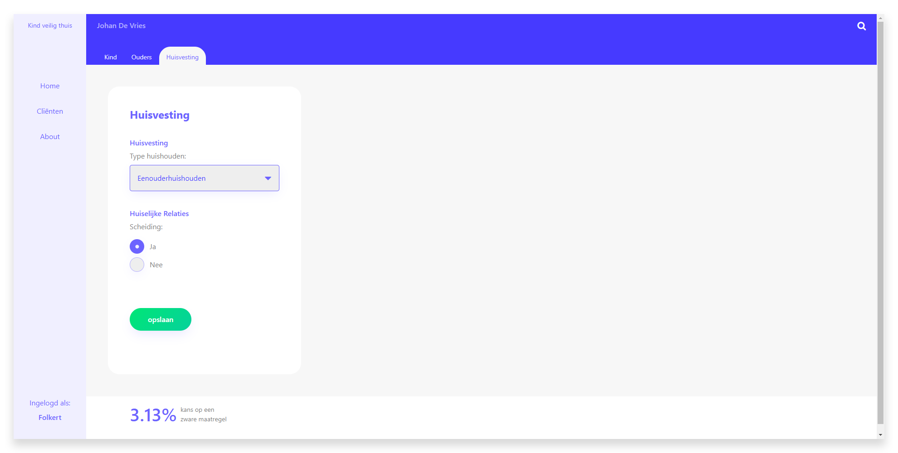
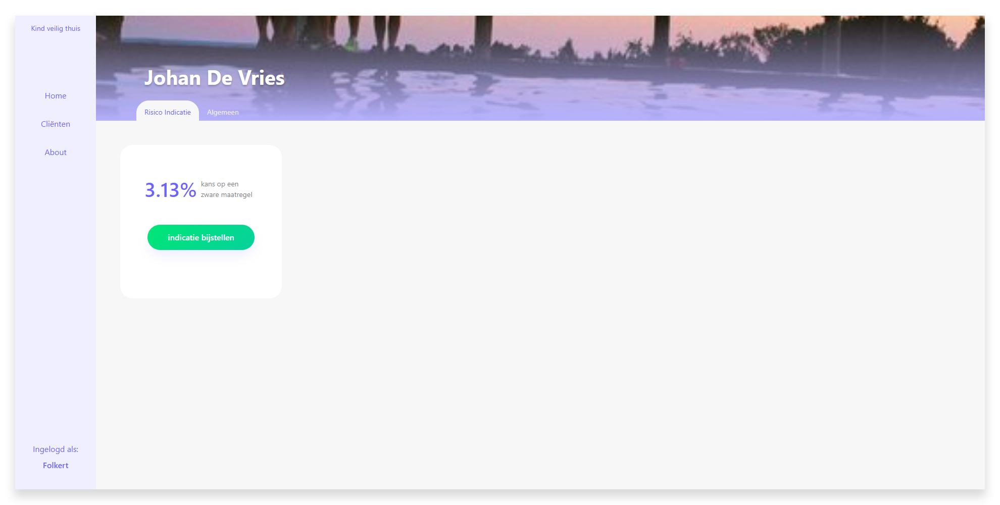
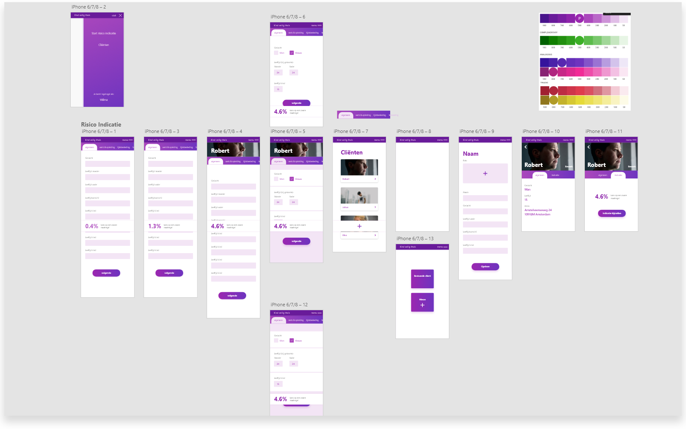
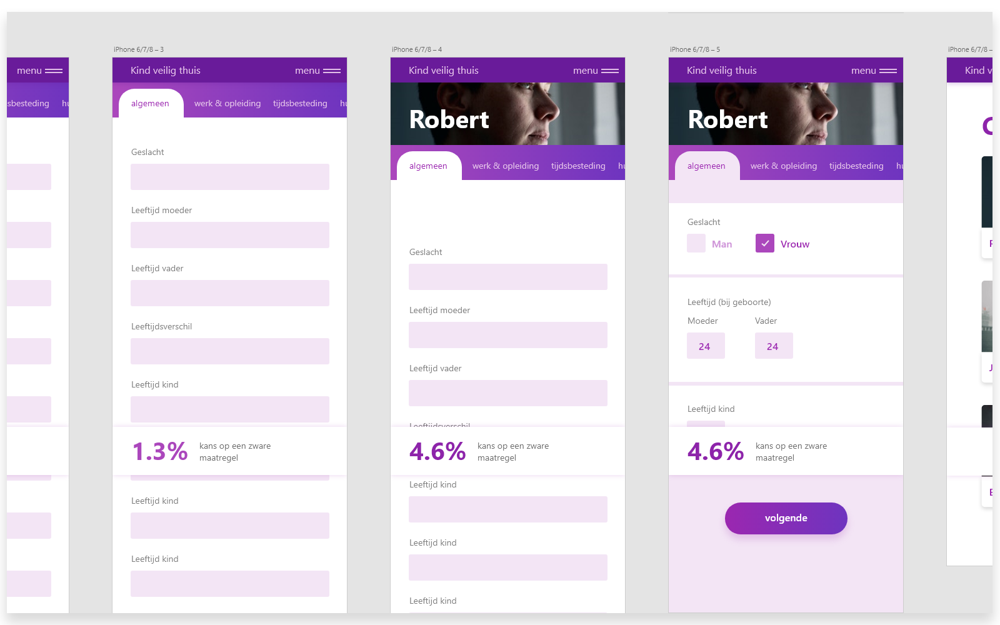
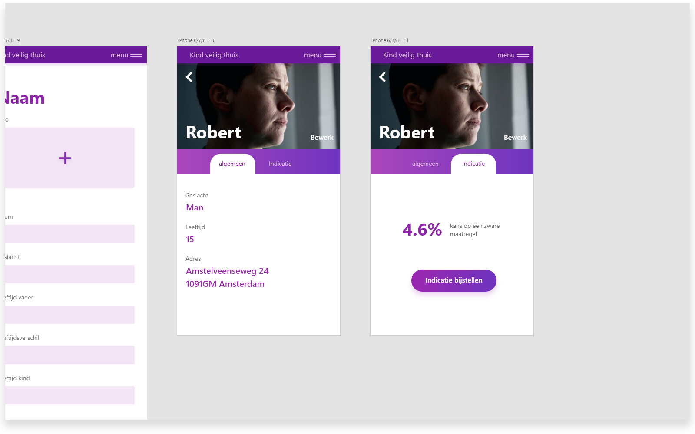

# frontend-applications (Kind Veilig Thuis)

## Summary
Fully responsive prototype of a [vue](https://vuejs.org/) webapp which helps youth social workers to quickly estimate the risk of their clients ending up in an intense help program.   
[check the live prototype here](https://frontend-applications.netlify.com)

## Table of Contents
- [Install](#install)
- [Prototype](#prototype)
- [Process](#process)
  - [Concept](#concept)
  - [Wireframes](#high-fidelity-wireframes)
  - [Final concept](#final-concept)
  - [Code](#code-journey)
- [To do](#to-do)
- [Credits](#credits)

## Install
```bash
# If you are on a higher npm version than 10, change npm version to 10 (sass-loader doesn't take version 11 kindly currently)
nvm use 10

# Install necessary packages
npm install

# Compiles and hot-reloads for development
npm run serve

# Compiles and minifies for production
npm run build
```

## Prototype
[check the live prototype here](https://frontend-applications.netlify.com)

In the prototype you can browse to any of the pages, but the 'clienten' endpoint is secured behind a login. Since the information about the clients is sensitive, it's important to keep people out who have no business looking into their information (for prototpye's sake, there's a register account option. In production the social workers would be given an account from the company).
(All text in the prototype are written in dutch. I've used solely english in the code (variable names, parameter names, etc.))


---

After succesfully logging in, the social worker can see his current clients (adding clients in the dashboard is on the [to-do list](#to-do)).


---

When browsing to a specific client, the social worker can see the current calculated risk of the client ending up in an intense help program. It's also made clear wether or not all the fields of the form have been filled in.


---

Upon choosing to edit or filling in the risk calculation form, a page shows up with three sub pages: Child, Parent and Home situation. All the questions in these pages are grouped together under these types. Within the types are certain categories of questions, like age, gender etc.


---

Filling in the fields of the form automatically rerenders the percentage bar in the bottom of the screen. This is the actual risk indication. The darker the color gets, the more severe the chance is of the client having to go through an intense help program.


---

Upon saving the form, you get redirected back to the specific client you were editing the risk indication form of. You can see the changes in the percentage get reflected on this page.


## Process
### Concept
This project is based on an already existing prototype called 'Kind Veilig Thuis' by Arjan de Jager, program manager at [Garage2020 Amsterdam](http://www.garage2020.nl/).
Some social workers are already putting this very rough prototype to use in the field. The results are looking promising, so Arjan would like to have a more user friendly prototype, possibly with a little change in the concept as well.   
In Arjan's prototype, there is no way to save the risk indication somewhere, or link it to a client. Very early on in the process of this project I realized that if I were a social worker, I would like to maybe fill in questions about a client that I know the answer to, and leave questions that I don't know the answer to open for later.    
This required me to work with the possibility of having clients in your account, where you can change the risk indication for every client.

Since the questions in the form can be considered sensitive information when linked to a person, I decided that last names of clients should be stored in the database in a hash. This way in the event of a database leak it would be very hard to link the results to a specific person, since the answers to the questions are kind of general, but would also require intimate knowledge of people to be able to link it to a specific individual.

One of the first things in the prototype of Arjan that I felt needed improvement was the showcase of the risk percentage. In his prototype to see the result of what you anwsered to the questions, you have to press a button every time you make a change.
When building my version I made sure that the percentage updates automatically any time you change a value of one of the input fields.

In the early stages of the project I didn't really look at the hierarchy and order that the questions were clustered in, so for the time being I copied the layout that Arjan uses in his prototype.

### High Fidelity Wireframes
I made a mobile-first design because I wanted the social workers to have the option to fill in the risk indication form on their smartphone.


---

As you can see, the design for the tab-based pages hasn't changed much in the final prototype.
I decided to use horizontal tabs to give the user a sense of continuity instead of having to visually search for the next step.
In the final prototype I removed the image of the client since I felt it only distracted the user from the task at hand.


---

In the wireframes of the client detail page I first put the general information about the person to be the first thing you'd see when opening the page.
I later on decided to put the current calculated risk percentage to the front, since that's the most important piece of information within this prototype.


### Final concept
During the development stage of the prototype I felt that the list of questions was quite long, and it could be hard for social workers to find specific input fields that they want to change or set the value of.
As you can see in the wireframes, I didn't include a search button on the form. I decided to add one, where as you type only the questions that match the current search query are shown. This makes it alot easier to quickly change some information about the client.

After critically looking at the layout of the questions within tabs, the order and grouping made less and less sense to me. Questions about the client, their parents and home were asked with seemingly no order among them, other than a 'category' linking them.   
I decided to regroup the questions based on if it was about the client, their parents or their home. This resulted in three tabs. Within these pages, the questions are grouped by the old categories. This makes for a more logical grouping of questions compared to Arjan's prototype.

### Code Journey
This was the first time I've worked with [vue](https://vuejs.org). I quickly found out about the vue-cli, which saved a lot of headache setting up the project.
After most of the structure of the prototype was in place, I kept running into the problem of passing data from parents to child. It was hard to keep track of what was triggering what. It seemed also unnecessary hard to have two sibling components share data with eachoter.
I first solved this problem with an [EventBus](https://medium.com/@andrejsabrickis/https-medium-com-andrejsabrickis-create-simple-eventbus-to-communicate-between-vue-js-components-cdc11cd59860), but quickly switched over to [VueX](https://vuex.vuejs.org/).
I actually learned nearly everything about vue from reading [their documentation](https://vuejs.org/v2/guide/).

The hardest functionalities to implement were the navigation within the tabpages of the risk indication form combined with the search function where filtering happened on every keystroke. The functionality for most of those features can be found in `src/components/FormRiskAnalysis.vue` and `src/services/questions.js`.

I learned alot about using the 'new' array functions during the making of my [functional-programming project](https://github.com/follywolly/functional-programming) and [frontend-data project](https://github.com/follywolly/frontend-data), so that made writing this project alot more easy.

For storing necessary information that had to keep existing on page reloads I decided to use sessionStorage. I chose this over localStorage since it wipes itself when closing the current tab, which is what most secure webapps seem to apply.

For fun I added a `manifest.json` and service worker to open up possibilities to add the prototype to the home screen of a smartphone.

## To do
- [ ] Add option to create new clients
- [ ] Some more code cleanup
- [ ] Restructuring the files and components to a more clear hierarchy
- [ ] Live prototype that utilizes database and server

## Credits
- [Katerina Limpitsouni](https://undraw.co) - Awesome illustrations with an open license
